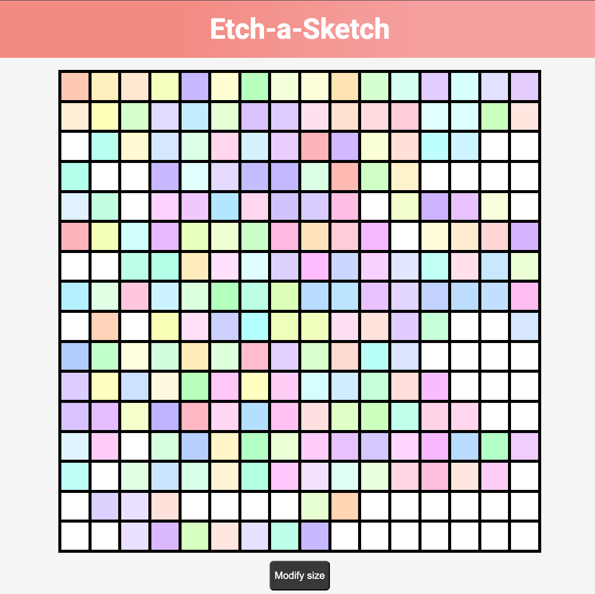

# 🎨 Etch-a-Sketch

This is a simple **Etch-a-Sketch-inspired** web project built using **HTML**, **CSS**, and **JavaScript**.  
It features a grid of squares that change to random **pastel colors** when hovered over with the mouse.  
You can also specify the number of grid squares to customize the drawing canvas.

## ✨ Features
- Interactive grid that responds to mouse hover  
- Random pastel color generation for each square  
- Adjustable grid size 

## 💡 Purpose
This project was created to practice:
- DOM manipulation and dynamic element creation with JavaScript  
- Handling user interactions through event listeners   

## 🚀 How to Run
1. Clone or download this repository  
2. Open `index.html` in your browser  

## 📸 Preview

🖋️ **Author:** Lance Santos
